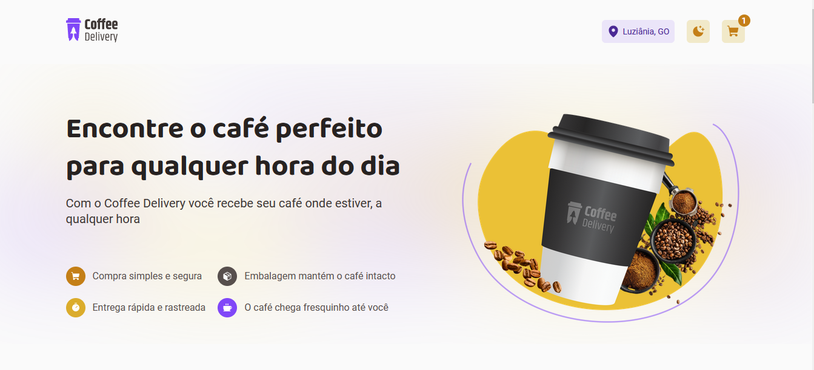

<br />

  <h1 align="center">Luiz Felipe - Coffee Delivery :coffee: </h1>

<div align="center"></div>

<br>

> :mag_right: O Coffee Delivery é uma aplicação que imita o fluxo da compra de um produto, no qual o usuário tem um catálogo de produtos(cafés), onde pode filtrar por categoria e adicionar a quantidade de café de sua preferência e depois preencher o formulário de entrega.
> <br>

:paperclip: Link da aplicação: https://coffee-delivery-luizfelipe63.vercel.app/

## :computer: Funcionalidades

- Listagem de produtos (cafés) disponíveis para compra
- Adicionar ou remover uma quantidade específicas de itens no carrinho
- Exibir o total de itens no carrinho no Header
- Exibir o valor total da soma de itens no carrinho multiplicados pelo valor
- Filtrar os produtos (cafés) conforme a categoria

## :rocket: Tecnologias

- [Vite](https://vitejs.dev/)
- [React](https://pt-br.reactjs.org/)
- [TypeScript](https://www.typescriptlang.org/)
- [React Hook Form](https://react-hook-form.com/)
- [Styled Components](https://styled-components.com/)
- [ESLint](https://eslint.org/)

## :round_pushpin: Como Usar

<h3>Pré-requisitos</h3>

- [NodeJS](https://github.com/)
- [Git](https://github.com)
- [npm](https://www.npmjs.com/)

<h3>Clonar</h3>

```bash
git clone https://github.com/luizfelipe63/Coffe-Delivery
```

<h3>Iniciar</h3>

```bash
cd Coffe-Delivery
npm install
npm run dev
```

## :punch: Colaboradores

<table>
  <tr>
    <td align="center">
      <a href="https://www.linkedin.com/in/luiz-feliperocha/">
        <br>
        <sub>
          <b>Luiz Felipe</b>
        </sub>
      </a>
    </td>
  </tr>
</table>
